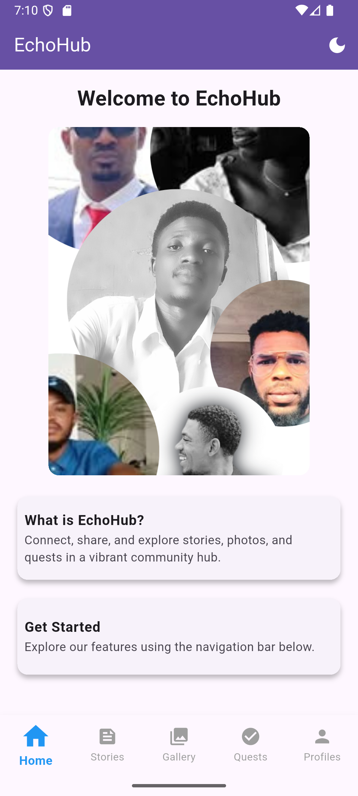

EchoHub
Overview
EchoHub is a vibrant Flutter app that connects users through stories, photos, and quests. With a sleek interface, seamless navigation, and offline support, making community engagement fun and intuitive.

Features
Story Feed: Share and explore user stories.
Gallery: Browse and view photos with details.
Quests: Complete tasks and track progress.
Profiles: Discover user profiles and their contributions.
Comments: Engage with posts through comments.
Theme Toggling: Switch between light and dark modes.
Animations: Enjoy smooth fade, slide, and shimmer effects.
Offline Caching: Access content without an internet connection.

Join the EchoHub community and start connecting today!